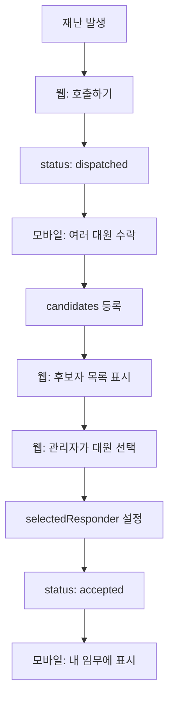

# 🚀 다중 후보자 시스템 마이그레이션 가이드

## 📋 개요
긴급구조 시스템을 단일 대원 배정 방식에서 **다중 후보자 시스템**으로 전환했습니다.

### 변경 전 (구 시스템)
- 가장 먼저 수락한 대원이 자동으로 배정됨
- 문제점: 가까운 대원이 배정받지 못하는 경우 발생

### 변경 후 (신규 시스템)
- 여러 대원이 후보자로 등록
- 관리자가 최적의 대원을 선택
- 장점: 거리, 자격증, 상황을 고려한 최적 배치 가능

## 🔄 주요 변경사항

### 1. 데이터 구조 변경

#### Firebase 구조
```javascript
// 구 시스템
calls/
  callId/
    status: "accepted"
    responder: {
      id: "resp_userId_timestamp"
      name: "김철수"
      position: "대원"
    }

// 신규 시스템
calls/
  callId/
    status: "dispatched" → "accepted"
    candidates: {
      userId1: {
        id: "cand_userId1_timestamp"
        userId: "userId1"
        name: "김철수"
        position: "대원"
        acceptedAt: 1234567890
        routeInfo: { ... }
      },
      userId2: { ... }
    }
    selectedResponder: {
      userId: "userId1"
      name: "김철수"
      selectedAt: 1234567890
      ...
    }
```

### 2. 타입 정의 변경

#### 웹 대시보드 (TypeScript)
```typescript
// src/services/callService.ts
export interface Call {
  // 기존 필드들...
  
  // 제거됨
  // responder?: Responder;
  
  // 추가됨
  candidates?: Record<string, {
    id: string;
    userId: string;
    name: string;
    position: string;
    rank?: string;
    acceptedAt: number;
    routeInfo?: RouteInfo;
  }>;
  
  selectedResponder?: {
    id: string;
    userId: string;
    name: string;
    position: string;
    rank?: string;
    acceptedAt: number;
    selectedAt: number;
    routeInfo?: RouteInfo;
  };
}
```

#### 모바일 앱 (Dart)
```dart
// lib/models/call.dart
class Call {
  // 기존 필드들...
  
  // 변경됨
  final Responder? selectedResponder; // responder → selectedResponder
  final Map<String, Candidate>? candidates; // 신규 추가
}

class Responder {
  final String userId; // 신규 필드 (중요!)
  // 기타 필드들...
}
```

### 3. 주요 함수 변경

#### 대원 선택 함수 (신규)
```typescript
// src/services/callService.ts
export const selectResponder = async (
  callId: string,
  candidateId: string
): Promise<void> => {
  // Transaction으로 안전하게 처리
  // 1. 후보자 확인
  // 2. selectedResponder 설정
  // 3. status를 'accepted'로 변경
}
```

#### 수락 프로세스 변경
```typescript
// 구 시스템: 즉시 responder로 배정
acceptCall() → status: 'accepted', responder 설정

// 신규 시스템: 후보자로만 등록
acceptCall() → candidates에 추가만 함
```

## 🔍 "내 임무" 판단 로직 변경

### 웹 대시보드
```typescript
// 변경 없음 (관리자는 모든 임무 확인 가능)
```

### 모바일 앱
```dart
// 구 시스템
final isMyMission = call.responder!.id.contains(userId);

// 신규 시스템
final isMyMission = call.selectedResponder!.userId == userId;
```

## 📱 UI/UX 변경사항

### 웹 대시보드
1. **후보자 패널 추가**
   - 실시간 후보자 목록 표시
   - 거리, 자격증 정보 표시
   - "선택" 버튼으로 대원 배정

2. **상태 표시 변경**
   - "찾는중" → 후보자 모집 중
   - "매칭완료" → 대원 선택됨

### 모바일 앱
1. **수락 프로세스**
   - "수락하기" → 후보자로 등록
   - 선택 대기 상태 표시
   - 선택 결과 알림

## ⚙️ 구현 세부사항

### Transaction 사용
```typescript
// 동시성 문제 해결을 위해 Transaction 사용
runTransaction(callRef, (currentData) => {
  // 원자적 업데이트 보장
});
```

### 하위 호환성
- `responder.id`에서 `userId` 추출 가능
- `selectedResponder.userId` 직접 사용

## 🚨 주의사항

1. **Firebase Rules 업데이트 필요**
   ```javascript
   // candidates 노드 읽기/쓰기 권한 설정
   "candidates": {
     "$userId": {
       ".write": "$userId === auth.uid"
     }
   }
   ```

2. **타입 안정성**
   - TypeScript와 Dart 타입 정의 동기화 필수
   - `userId` 필드 존재 여부 확인

3. **마이그레이션**
   - 기존 데이터는 그대로 유지
   - 새로운 호출부터 신규 시스템 적용

## 📊 시스템 흐름도



## ✅ 테스트 체크리스트

- [ ] 웹: 호출하기 작동
- [ ] 모바일: 수락 시 후보자로 등록
- [ ] 웹: 후보자 목록 실시간 업데이트
- [ ] 웹: 대원 선택 기능
- [ ] 모바일: 선택된 대원만 "내 임무" 표시
- [ ] 전체: 동시성 문제 없음

## 🔧 디버깅 팁

### 콘솔 로그 확인
```javascript
// 웹
[selectResponder] 시작: callId, candidateId
[selectResponder] 선택 성공

// 모바일
[CallDataService] 활성 임무 확인: userId=xxx
[CallDataService] 임무 소유자 확인: responderId=xxx
```

### Firebase Console 확인
1. `candidates` 객체 구조
2. `selectedResponder` 필드
3. `status` 변경 추적

## 📅 구현 일자
- 2025년 1월 31일

## 👥 영향받는 컴포넌트

### 웹 대시보드
- `/services/callService.ts`
- `/components/dashboard/CandidatesInfo.tsx`
- `/components/call-detail/CallCandidatesPanel.tsx`
- 기타 Call 타입 사용하는 모든 컴포넌트

### 모바일 앱
- `/models/call.dart`
- `/services/call_data_service.dart`
- `/services/improved_call_acceptance_service.dart`

## 🎯 다음 단계
1. Firebase Rules 최적화
2. 자동 선택 알고리즘 구현 (거리 기반)
3. 후보자 제한 시간 설정
4. 선택 알림 시스템 구현
